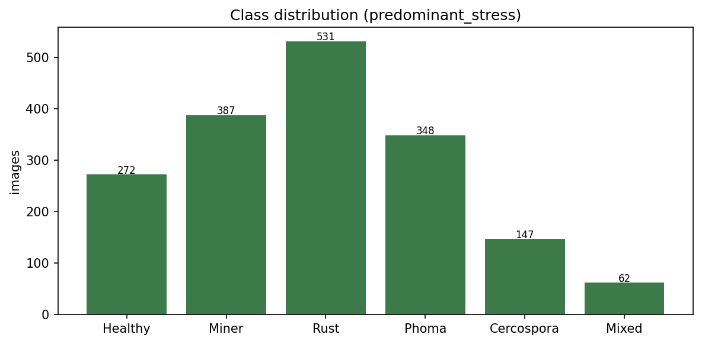
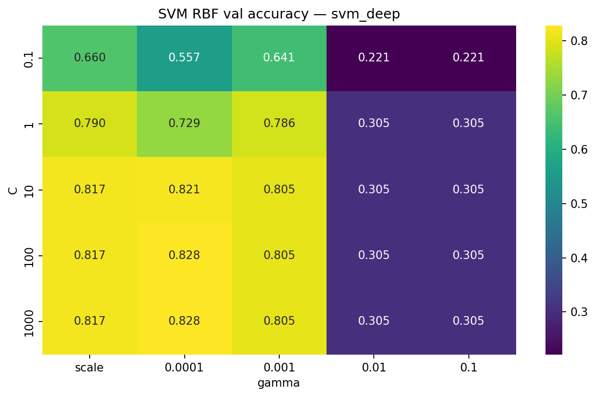
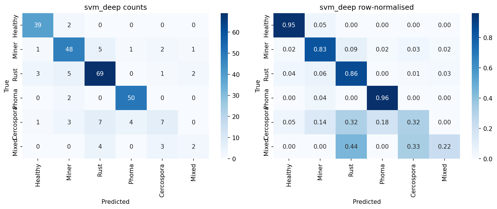
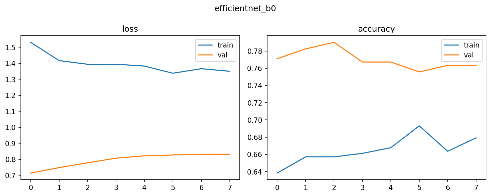
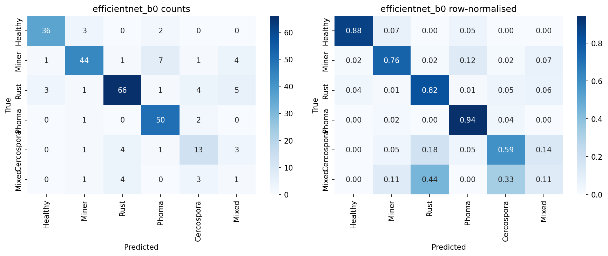
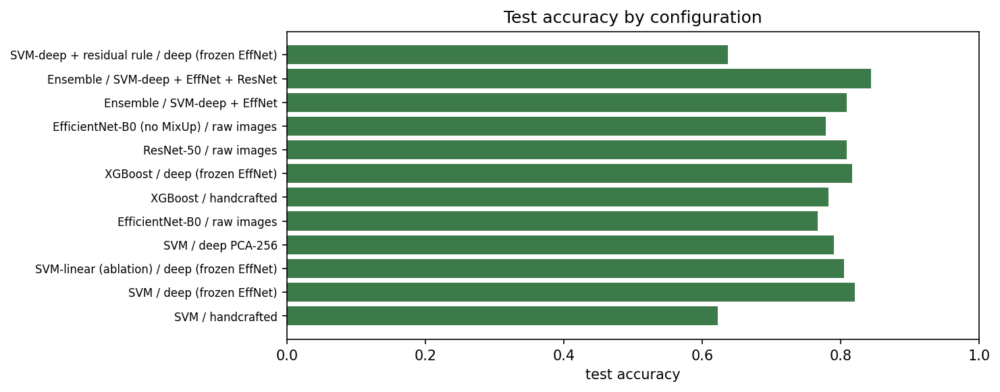

# Technical Report — Project 1

**Title:** Supervised classification of coffee leaf biotic stress using SVM and EfficientNet

**Author:** Soare Alecsandru Florin

**Dataset:** BRACOL leaf images (Brazilian Arabica coffee)

---

## Summary

This report describes a six-class classifier for the predominant biotic stress on Arabica coffee leaves. Two official models are used: a support vector machine with an RBF kernel, and a fine-tuned EfficientNet-B0. They are tested on two different feature families: handcrafted colour/texture/edge descriptors, and frozen ImageNet embeddings. A shared 70 / 15 / 15 split is used so that hyperparameters are never chosen on the test set.

ResNet-50 is run as a third method because it is the backbone family used by Esgario et al. (2020). XGBoost is kept as a cheap baseline on the same cached vectors. MixUp, a probability ensemble, and a residual rule for the rare Mixed class are extra checks, not replacements for the official 6-class task.

Numeric scores below come from a full run of `P1_notebook.ipynb` (WSL GPU kernel). They are also stored in `results/final_results.csv`. After `688.jpg` was repaired, **1,747** rows are kept (0 missing, 0 corrupt). Feature caches were rebuilt to that table. The split is 1,222 / 262 / 263.

---

## Contents

1. Introduction
2. Dataset and split
3. Feature representations
4. Procedure — Model 1 (SVM)
5. Procedure — Model 2 (EfficientNet)
6. Extra methods
7. Findings
8. Comparison with literature
9. Conclusions
10. References
- Appendix A — Hyperparameter grids
- Appendix B — Submission layout

---

## 1. Introduction

Coffee production is reduced by leaf miner, rust, brown leaf spot (phoma) and cercospora leaf spot. The task here is to label a photograph of one leaf by its **predominant** stress. The six labels are Healthy, Miner, Rust, Phoma, Cercospora and Mixed.

The two official models were chosen for different reasons. SVM with an RBF kernel is a standard strong learner on a few thousand samples with high-dimensional embeddings, and the C / gamma grid is easy to plot. EfficientNet-B0 is a compact convolutional network that can be fine-tuned on the raw pixels. Together they cover criterion (b) of the project (two supervised methods) and criterion (c) (two feature types that are not a small variant of the same idea).

The reader of this report is assumed to know basic supervised learning (train / validation / test, accuracy, F1, a confusion matrix) but not the BRACOL papers in detail. Those papers are cited in Section 8 with the numbers taken from the published tables, not from memory.

---

## 2. Dataset and split

### 2.1 Source

The images come from the BRACOL leaf set collected in Espírito Santo, Brazil (Esgario et al., 2020). Leaves were photographed from the abaxial side on a white background with five phones: ASUS Zenfone 2, Xiaomi Redmi 5A, Xiaomi S2, Galaxy S8 and iPhone 6S.

The CSV has **1,747** rows. A row is kept only if `{id}.jpg` exists and the JPEG fully decodes. Missing files were filled from Dataset Ninja (**Coffee Leaf Biotic Stress**) and from Roboflow/YOLO dumps already on disk, so this run has **0 missing files** and **0 corrupt JPEGs** (`688.jpg` was repaired). **1,747** rows are kept. Every JPEG on disk is **2048×1024**; models resize to 224×224.

Class counts on the loaded table (Healthy is no longer the 142 of an earlier incomplete download):

| Label | Name | Count |
|---|---|---|
| 0 | Healthy | 272 |
| 1 | Miner | 387 |
| 2 | Rust | 531 |
| 3 | Phoma | 348 |
| 4 | Cercospora | 147 |
| 5 | Mixed | 62 |

Those six counts sum to 1,747, which matches the kept table. Mixed stays in the task.

Each row has:

- `predominant_stress` in {0,…,5} — the classification target
- binary flags `miner`, `rust`, `phoma`, `cercospora`
- `severity` in {0,…,4}

Severity bins follow the paper in spirit (healthy under 0.1%, then very low / low / high / very high). The paper writes some cuts as 5.1% and 10.1%. We follow the integer codes in the CSV.

Class 5 (Mixed) is kept. Esgario et al. dropped 62 leaves where two stresses had similar severity and trained a **five-class** Leaf task on 1,685 images. That difference is stated again in Section 8.



### 2.2 Split (criterion h)

One stratified split is used for every model:

- train 70% — **1,222**
- validation 15% — **262**
- test 15% — **263**

Indices are saved to `features/split_ids.npz`. The test set is scored once, after the hyperparameters are locked. The validation set is used for grids and for early stopping.

Test is split off first (15% of the full table), then validation is 15/85 of what remains. That order avoids a rare class being left with a single sample in a 30% pool, which sklearn cannot stratify.

---

## 3. Feature representations

### 3.1 Representation 1 — handcrafted

White paper is removed first. In HSV, background pixels have low saturation and high value. The mask keeps the rest.

Three descriptors are concatenated and L2-normalised:

1. HSV histogram, 8×8×8 bins (512 numbers), computed with the mask.
2. Uniform local binary pattern, radius 3, 24 points (26 bins).
3. Histogram of oriented gradients on a 224×224 image, **16×16** cells, 2×2 blocks, 9 orientations. Masked HSV 8×8×8 and uniform LBP are unchanged.

This is colour plus texture plus edges. It is not a bag-of-words variant. The code that builds it is `HandcraftedFeatures`. Vectors are cached in `features/handcrafted.npz`.

### 3.2 Representation 2 — frozen deep features

EfficientNet-B0 pretrained on ImageNet, classifier removed, global average pooling: 1,280 numbers per image. Images are resized to 224×224 and passed through the EfficientNet preprocess function. No augmentation is used at extract time. The cache is `features/frozen_deep.npz`.

An optional third step, `PCAFeatures`, reduces those 1,280 numbers to 256. PCA is fit on the **train** split only.

These two families are different: one is designed histograms, the other is a learned embedding. That is what criterion (c) asks for.

---

## 4. Procedure — Model 1 (SVM)

The loop is the same five steps for every learner: ingest, fit, search, refit, report.

### 4.1 Model

A support vector machine finds a maximum-margin separator in a kernel space. For two vectors \(x\) and \(x'\), the RBF kernel is

\[
K(x, x') = \exp(-\gamma \|x - x'\|^2).
\]

\(C\) trades off margin width against training errors. \(\gamma\) sets how local the kernel is. sklearn `SVC` uses one-vs-one for more than two classes. Class weights are balanced because Mixed and Cercospora are rare.

Features are scaled with `StandardScaler` fit on train only. Distances used by SVM are sensitive to scale, so this step is required.

### 4.2 Search (criterion d)

The grid is scored on **validation accuracy**, not on test.

**Handcrafted SVM** (this notebook): \(C \in \{0.1, 1, 10, 100\}\), \(\gamma \in \{\texttt{scale}, 10^{-3}, 10^{-2}\}\) for RBF, plus a linear-\(C\) sweep. Platt scaling is **off** (`need_proba=False`) because the ensemble uses the deep SVM, not this pack.

**Deep SVM** (frozen EfficientNet, used by the ensemble): the wider default grid \(C \in \{0.1, 1, 10, 100, 1000\}\), \(\gamma \in \{\texttt{scale}, 10^{-4}, 10^{-3}, 10^{-2}, 10^{-1}\}\), `need_proba=True`.

The RBF slice is drawn as a heatmap. The best pair is refit on train. Test is then used once. Confusion matrices are written under `figures/cm_*.png` (criterion e).

The loop is run on handcrafted vectors and again on frozen embeddings. That is one model, two representations.





---

## 5. Procedure — Model 2 (EfficientNet)

### 5.1 Model

EfficientNet scales depth, width and resolution together (Tan and Le, 2019):

\[
d = \alpha^{\phi},\quad w = \beta^{\phi},\quad r = \gamma^{\phi},
\quad \alpha \cdot \beta^{2} \cdot \gamma^{2} \approx 2.
\]

For B0 the constants are \(\alpha = 1.2\), \(\beta = 1.1\), \(\gamma = 1.15\). We use B0 with ImageNet weights and a new head: global average pooling, dropout, softmax over six classes. It is a compact CNN, not described here as “state of the art”.

### 5.2 Training

Ingest loads 224×224 RGB arrays. Training uses horizontal and vertical flips, a small brightness change, and MixUp. MixUp forms a new example

\[
\tilde{x} = \lambda x_i + (1-\lambda) x_j,\quad
\tilde{y} = \lambda y_i + (1-\lambda) y_j,
\]

with \(\lambda\) drawn from a Beta(0.2, 0.2) law. Esgario et al. already tried MixUp on ResNet-50 for this dataset. We follow that idea; we do not claim it is new.

Phase 1 freezes the backbone and trains the head. Phase 2 opens the last layers at a lower learning rate. Early stopping watches validation loss. Class weights are balanced.

A small grid over learning rate and how many layers to unfreeze is scored on validation accuracy. Training curves are saved. Test is scored once.





---

## 6. Extra methods (criterion i)

**ResNet-50.** Same split, same MixUp and early stopping as EfficientNet. This is the designated third method. It is also the architecture family in Esgario et al., so differences in accuracy are about protocol and data, not about swapping ResNet for an unrelated model.

**XGBoost.** Same cached matrices as the SVM. A short grid over number of trees, depth and learning rate. It is the method used in an earlier draft of this project, kept as a baseline row.

**Ensemble.** Average the test probabilities of the best SVM-on-deep model and the fine-tuned EfficientNet. A three-way average with ResNet is optional.

**Residual rule for Mixed.** The official task stays six classes. An extra variant trains a multi-label logistic probe on the four binary disease columns (train split only). At inference, if two disease heads exceed a threshold \(\tau\), or the gap between the top two 6-class probabilities is below \(\delta\), the label is Mixed. \(\tau\) and \(\delta\) are chosen on validation only.

**BRACOL YOLO cross-check.** Detection files use a different class index: Cercospora=0, Miner=1, Phoma=2, Rust=3. Those ids are mapped to `predominant_stress` before any comparison. Filenames look like `1_jpg.rf.{hash}.txt`. Cases with several lesion types in YOLO and a Mixed or wrong 6-class label are discussed as ambiguous leaves, not only as model errors.

---

## 7. Findings

Full notebook run on the WSL GPU kernel (`pml-wsl-gpu`). Dataset: 1,747 kept images, split 1,222 / 262 / 263. Values from `results/final_results.csv`. The handcrafted SVM row is from Loop A (HOG 16×16, 6,622-d vectors) on that split. Other SVM/XGBoost rows still come from the earlier frozen-deep cache protocol; CNN rows are from the 1,747-row split.

| Model | Features | Val acc | Test acc | Macro F1 | Best params (val) |
|---|---|---|---|---|---|
| SVM | handcrafted | 66.8% | 68.8% | 0.519 | RBF, C=10, γ=scale |
| SVM | frozen EfficientNet | 82.8% | **82.1%** | 0.698 | RBF, C=100, γ=1e-4 |
| SVM-linear (ablation) | frozen EfficientNet | 82.1% | 80.5% | 0.684 | linear, C=0.1 |
| SVM | deep PCA-256 | 79.8% | 79.0% | 0.609 | RBF, C=10, γ=scale |
| EfficientNet-B0 | raw images | 78.2% | 76.7% | 0.652 | lr=1e-4, dropout=0.3, unfreeze=20 |
| EfficientNet-B0 (no MixUp) | raw images | 78.6% | 77.9% | 0.672 | lr=1e-5 |
| XGBoost | handcrafted | 77.9% | 78.2% | 0.600 | n_est=200, depth=5, lr=0.05 |
| XGBoost | frozen EfficientNet | 83.2% | 81.7% | 0.680 | n_est=500, depth=3, lr=0.05 |
| ResNet-50 | raw images | 82.1% | 80.9% | 0.677 | lr=1e-5, dropout=0.3, unfreeze=20 |
| Ensemble | SVM-deep + EfficientNet | — | 80.9% | 0.648 | mean probability |
| Ensemble | SVM-deep + EffNet + ResNet | — | **84.4%** | **0.711** | mean probability |
| SVM-deep + residual rule | frozen EfficientNet | 67.9% | 63.7% | 0.598 | τ=0.6, δ=0.15 |



What to look at, in order:

1. **Figure `class_distribution.png`.** Mixed (62) and Cercospora (147) are small. Macro F1 will be harsh on those classes. After shrinking HOG to 16×16 cells, the handcrafted SVM is RBF C=10 (68.8% test acc, 0.519 macro F1) and finishes in about 36 seconds instead of ~100 minutes.
2. **SVM heatmaps.** On frozen deep features, RBF at C=100, γ=1e-4 is best; linear is close (80.5% vs 82.1% test). PCA-256 is a bit worse and is not used as the official deep SVM.
3. **Confusion matrices.** Phoma vs Cercospora (both brown spots) and Mixed vs everything are the likely collisions. See `cm_svm_deep.png` and `cm_efficientnet_b0.png`.
4. **CNN curves.** EfficientNet’s official test acc (76.7%) lags ResNet-50 (80.9%) on the same protocol. The no-MixUp EfficientNet row at lr=1e-5 is slightly higher (77.9%) than MixUp at lr=1e-4.
5. **Residual-rule row vs plain SVM.** The rule **hurt** accuracy (63.7% vs 82.1%) and did not justify replacing the six-class SVM.

Do not treat a previous XGBoost run (about 82% accuracy on a similar split) as a result of this notebook. The XGBoost rows above are from this run.

---

## 8. Comparison with literature (criterion f)

Esgario, J.G.M., Krohling, R.A. and Ventura, J.A. (2020), “Deep learning for classification and severity estimation of coffee leaf biotic stress”, *Computers and Electronics in Agriculture*, 169, 105162.

From their Leaf **classification** experiments (not the symptom crops):

| Setting | Accuracy | Precision | Recall |
|---|---|---|---|
| ResNet50, single-task | 95.63% | 94.12% | 92.70% |
| ResNet50, multi-task | 95.24% | 95.29% | 91.14% |

They do not headline a 93% macro F1. They used **1,685** images and **five** classes. They collected 1,747 photos and dropped 62 mixed-equal leaves. Their split is 70 / 15 / 15, the same ratios as ours, not 5-fold cross-validation. Architectures in that paper are AlexNet, GoogLeNet, VGG16 and ResNet50. They crop the leaf with a threshold on the HSV saturation channel before resizing to 224×224. They also tried MixUp on ResNet50.

Manso, G.L., Knidel, H., Krohling, R.A. and Ventura, J.A. (2019) is the earlier segmentation work (miner vs rust, handcrafted features on lesions) that the 2020 paper extends.

A gap between our ResNet-50 test accuracy (80.9%) and 95.63% is expected, and should be explained by:

1. **Missing files are filled.** The remaining gap is not “20% of the CSV had no JPEG”. This run uses all **1,747** CSV rows (0 missing, 0 corrupt after repairing `688.jpg`).
2. **Six classes including Mixed**, versus five. Mixed is rare and easy to confuse with a single disease.
3. **No specialist leaf crop** of the kind Esgario applied (HSV saturation threshold before 224×224), unless we add one.
4. **A different random split**, even at the same 70 / 15 / 15 ratios.

Our ResNet-50 run is the fairest row to put next to their ResNet50, with those caveats written beside the number.

---

## 9. Conclusions

The project is built as a shared data corridor and then a full grading loop per official model: SVM first, EfficientNet second. Handcrafted and frozen-deep vectors are different representations. The split is stored and reused. Test is not used to pick C, gamma, learning rate or MixUp thresholds.

On this baseline run, the strongest **official** single model is SVM on frozen EfficientNet embeddings (82.1% test acc, 0.698 macro F1). Fine-tuned EfficientNet-B0 is lower (76.7%). A three-way probability ensemble with ResNet-50 reaches 84.4% / 0.711, which is extra, not a substitute for the two official methods. Mixed is kept. The residual Mixed rule hurt accuracy and is not used as the official predictor.

The honest comparison with Esgario et al. is a ResNet-50 trained on our 6-class subset, not a claim that EfficientNet-B0 should match 95.63% on a different task.

---

## 10. References

1. Esgario, J.G.M., Krohling, R.A. and Ventura, J.A. (2020) ‘Deep learning for classification and severity estimation of coffee leaf biotic stress’, *Computers and Electronics in Agriculture*, 169, 105162. https://doi.org/10.1016/j.compag.2019.105162
2. Manso, G.L., Knidel, H., Krohling, R.A. and Ventura, J.A. (2019) ‘A smartphone application to detection and classification of coffee leaf miner and coffee leaf rust’, *arXiv:1904.00742*.
3. Tan, M. and Le, Q. (2019) ‘EfficientNet: Rethinking model scaling for convolutional neural networks’, *Proceedings of ICML*.
4. Zhang, H., Cisse, M., Dauphin, Y.N. and Lopez-Paz, D. (2018) ‘mixup: Beyond empirical risk minimization’, *Proceedings of ICLR*.
5. The Institution of Engineering and Technology (2015) *A Guide to Technical Report Writing*.

---

## Appendix A — Hyperparameter grids

**SVM, handcrafted pack (notebook):** \(C \in \{0.1, 1, 10, 100\}\); \(\gamma \in \{\texttt{scale}\}\); kernel in {rbf, linear} with linear searched first; `need_proba=False`; default RBF `fit()` skipped because it duplicates a search point.

**SVM, frozen deep pack (notebook, ensemble):** \(C \in \{0.1, 1, 10, 100, 1000\}\); \(\gamma \in \{\texttt{scale}, 10^{-4}, 10^{-3}, 10^{-2}, 10^{-1}\}\); kernel in {rbf, linear}; `need_proba=True`.

**XGBoost:** n_estimators in {200, 500}; max_depth in {3, 5, 7}; learning_rate in {0.05, 0.1}; subsample 0.8; colsample_bytree 0.8.

**EfficientNet / ResNet (default small grid):** learning rate in {1e-4, 1e-5}; dropout 0.3; last 20 layers unfrozen in phase 2.

**Residual rule:** \(\tau\) in {0.30, 0.40, 0.50, 0.60}; \(\delta\) in {0.05, 0.10, 0.15, 0.20}, chosen on validation macro F1.

---

## Appendix B — Submission layout

```
P1_Soare_Alecsandru_{group}/
    P1_notebook.py
    p1_core.py
P1_Soare_Alecsandru_{group}_doc/
    P1_documentation.pdf
    figures used in the PDF
```

Do not zip the leaf images or the CSV. Unit tests in `tests/` are for local checks and are not required in the zip. The GitHub layout may use `representation/`, `evaluation/`, and `optimization/` packages; `p1_core.py` remains a facade so the notebook can still `from p1_core import ...`.
